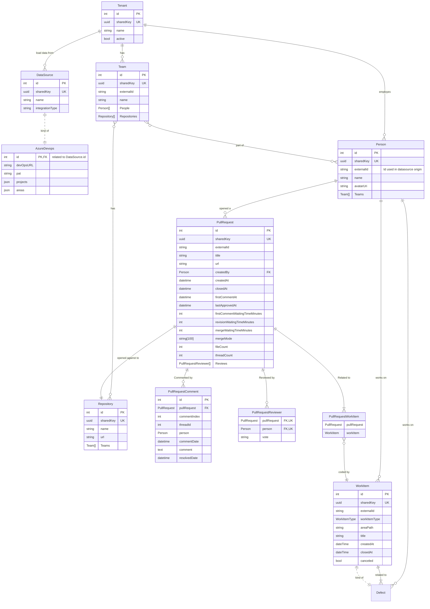

# Requirements

## Geral
Precisamos analisar a performance do processo de desenvolvimento de times e indivíduos, olhando para os números gerados pelo processo de codificação, abertura de pull request, code review, bugs abertos por code review.

O produto deve:

- Criar meios de aferir a efetividade do processo de code review;
- Medir a aderência aos padrões processuais para desenvolvimento;
- Criar insights que permitam perceber o entrosamento de indivíduos aos processos de desenvolvimento do time;
- Permitir análises de performance de times e indivíduos, fornecendo insights para melhoria.

O produto deve ser capaz de extrair dados do Azure DevOps. Porém, deve ser capaz de extrair os mesmos dados de outras plataformas.

### Entidades

- Tentant: É a empresa que está utilizando o sistema. 
- DataSource: Qual é a origem dos dados de análise. Pode ser azure DevOps, Bit Bucket, Jira e afins.
- Pessoas: Pode ser coordenadores, gestores, desenvolvedores, tech leaders, testers e afins;
- Times: Grupo de pessoas no seu menor nível granular (Squad);
- Pull Requests: Propostas de mudança de codígo, aberta pelos desenvolvedores;
- Cards: Itens de trabalho que contém as especificações técnicas e de negócio de cada alteração de código. Podem ser bugs, features, stories e afins;
- Usuário: Pessoa utilizando o sistema. Essa pessoa pode ter papéis:
  - SysAdmin: pode navegar entre todos os times de um tenant;
  - Manager: pode navegar entre todos os timeas e pessoas que gerencia;
  - Pawns: pode ver a performance dos times em que faz parte e a sua própria performance;

